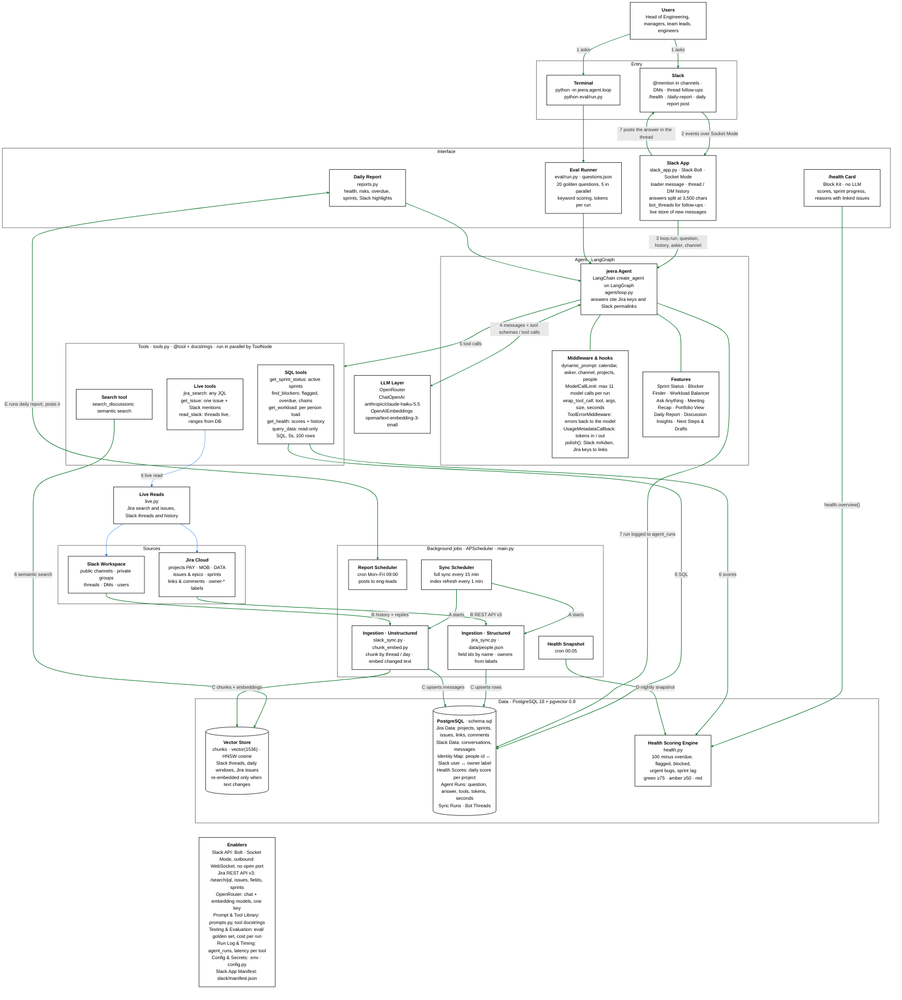

# PROTOTYPE

```mermaid
flowchart TB
    users["<b>Users</b><br/>Head of Engineering, managers, team leads, engineers"]

    subgraph entry["Entry"]
        direction LR
        slack["<b>Slack</b><br/>@mention in channels · DMs · thread follow-ups<br/>/health · /daily-report · daily report post"]
        cli["<b>Terminal</b><br/>python -m jeera.agent.loop<br/>python eval/run.py"]
    end

    subgraph ui["Interface"]
        direction LR
        slackapp["<b>Slack App</b><br/>slack_app.py · Slack Bolt · Socket Mode<br/>loader message · thread / DM history<br/>answers split at 3,500 chars<br/>bot_threads for follow-ups · live store of new messages"]
        healthcmd["<b>/health Card</b><br/>Block Kit · no LLM<br/>scores, sprint progress, reasons with linked issues"]
        evalrun["<b>Eval Runner</b><br/>eval/run.py · questions.json<br/>20 golden questions, 5 in parallel<br/>keyword scoring, tokens per run"]
        reports["<b>Daily Report</b><br/>reports.py<br/>health, risks, overdue, sprints, Slack highlights"]
    end

    subgraph agent["Agent · LangGraph"]
        direction LR
        core["<b>jeera Agent</b><br/>LangChain create_agent on LangGraph<br/>agent/loop.py<br/>answers cite Jira keys and Slack permalinks"]
        mw["<b>Middleware & hooks</b><br/>dynamic_prompt: calendar, asker, channel, projects, people<br/>ModelCallLimit: max 11 model calls per run<br/>wrap_tool_call: tool, args, size, seconds<br/>ToolErrorMiddleware: errors back to the model<br/>UsageMetadataCallback: tokens in / out<br/>polish(): Slack mrkdwn, Jira keys to links"]
        feat["<b>Features</b><br/>Sprint Status · Blocker Finder · Workload Balancer<br/>Ask Anything · Meeting Recap · Portfolio View<br/>Daily Report · Discussion Insights · Next Steps & Drafts"]
    end

    llm["<b>LLM Layer</b><br/>OpenRouter<br/>ChatOpenAI anthropic/claude-haiku-5.5<br/>OpenAIEmbeddings openai/text-embedding-3-small"]

    subgraph tools["Tools · tools.py · @tool + docstrings · run in parallel by ToolNode"]
        direction LR
        tlive["<b>Live tools</b><br/>jira_search: any JQL<br/>get_issue: one issue + Slack mentions<br/>read_slack: threads live, ranges from DB"]
        tsearch["<b>Search tool</b><br/>search_discussions: semantic search"]
        tsql["<b>SQL tools</b><br/>get_sprint_status: active sprints<br/>find_blockers: flagged, overdue, chains<br/>get_workload: per person load<br/>get_health: scores + history<br/>query_data: read-only SQL, 5s, 100 rows"]
    end

    live["<b>Live Reads</b><br/>live.py<br/>Jira search and issues, Slack threads and history"]

    subgraph data["Data · PostgreSQL 18 + pgvector 0.8"]
        direction LR
        vector[("<b>Vector Store</b><br/>chunks · vector(1536) · HNSW cosine<br/>Slack threads, daily windows, Jira issues<br/>re-embedded only when text changes")]
        pg[("<b>PostgreSQL</b> · schema.sql<br/>Jira Data: projects, sprints, issues, links, comments<br/>Slack Data: conversations, messages<br/>Identity Map: people id ↔ Slack user ↔ owner label<br/>Health Scores: daily score per project<br/>Agent Runs: question, answer, tools, tokens, seconds<br/>Sync Runs · Bot Threads")]
        healthengine["<b>Health Scoring Engine</b><br/>health.py<br/>100 minus overdue, flagged, blocked,<br/>urgent bugs, sprint lag<br/>green ≥75 · amber ≥50 · red"]
    end

    subgraph jobs["Background jobs · APScheduler · main.py"]
        direction LR
        reportsched["<b>Report Scheduler</b><br/>cron Mon–Fri 09:00<br/>posts to eng-leads"]
        syncsched["<b>Sync Scheduler</b><br/>full sync every 15 min<br/>index refresh every 1 min"]
        healthsched["<b>Health Snapshot</b><br/>cron 00:05"]
        ings["<b>Ingestion · Structured</b><br/>jira_sync.py · data/people.json<br/>field ids by name · owners from labels"]
        ingu["<b>Ingestion · Unstructured</b><br/>slack_sync.py · chunk_embed.py<br/>chunk by thread / day · embed changed text"]
    end

    subgraph sources["Sources"]
        direction LR
        jira["<b>Jira Cloud</b><br/>projects PAY · MOB · DATA<br/>issues & epics · sprints<br/>links & comments · owner-* labels"]
        slackws["<b>Slack Workspace</b><br/>public channels · private groups<br/>threads · DMs · users"]
    end

    enablers["<b>Enablers</b><br/>Slack API: Bolt · Socket Mode, outbound WebSocket, no open port<br/>Jira REST API v3: /search/jql, issues, fields, sprints<br/>OpenRouter: chat + embedding models, one key<br/>Prompt & Tool Library: prompts.py, tool docstrings<br/>Testing & Evaluation: eval/ golden set, cost per run<br/>Run Log & Timing: agent_runs, latency per tool<br/>Config & Secrets: .env · config.py<br/>Slack App Manifest: slack/manifest.json"]

    users -->|"1 asks"| slack
    users -->|"1 asks"| cli
    slack -->|"2 events over Socket Mode"| slackapp
    slackapp -->|"7 posts the answer in the thread"| slack
    cli --> evalrun
    slackapp -->|"3 loop.run: question, history, asker, channel"| core
    evalrun --> core
    reports --> core
    healthcmd -->|"health.overview()"| healthengine
    core --- mw
    core --- feat
    core <-->|"4 messages + tool schemas / tool calls"| llm
    core -->|"5 tool calls"| tools
    tlive -.->|"6 live read"| live
    live -.-> jira
    live -.-> slackws
    tsearch -->|"6 semantic search"| vector
    tsql -->|"6 SQL"| pg
    tsql -->|"6 scores"| healthengine
    core -->|"7 run logged to agent_runs"| pg

    syncsched ==>|"A starts"| ings
    syncsched ==>|"A starts"| ingu
    jira ==>|"B REST API v3"| ings
    slackws ==>|"B history + replies"| ingu
    ings ==>|"C upserts rows"| pg
    ingu ==>|"C upserts messages"| pg
    ingu ==>|"C chunks + embeddings"| vector
    healthsched ==>|"D nightly snapshot"| healthengine
    reports <==>|"E runs daily report, posts it"| reportsched

    data ~~~ enablers

    classDef node fill:#ffffff,stroke:#000000,stroke-width:1.5px,color:#000000
    class users,slack,cli,slackapp,healthcmd,evalrun,reports,core,mw,feat,llm,tlive,tsearch,tsql,live,vector,pg,healthengine,reportsched,syncsched,healthsched,ings,ingu,jira,slackws,enablers node
    style entry fill:#ffffff,stroke:#000000,color:#000000
    style ui fill:#ffffff,stroke:#000000,color:#000000
    style agent fill:#ffffff,stroke:#000000,color:#000000
    style tools fill:#ffffff,stroke:#000000,color:#000000
    style data fill:#ffffff,stroke:#000000,color:#000000
    style jobs fill:#ffffff,stroke:#000000,color:#000000
    style sources fill:#ffffff,stroke:#000000,color:#000000
    linkStyle 0,1,2,3,4,5,6,7,8,9,10,11,12,16,17,18,19,20,21,22,23,24,25,26,27,28 stroke:#1a7f37,stroke-width:2px
    linkStyle 13,14,15 stroke:#0969da,stroke-width:2px
```
